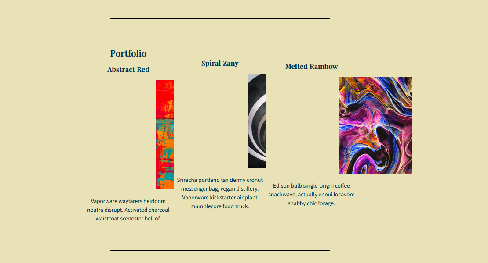
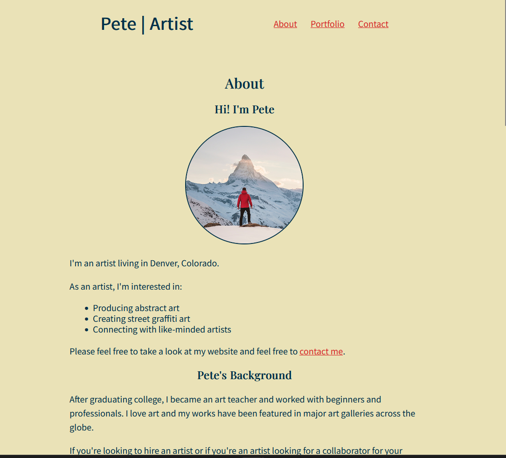
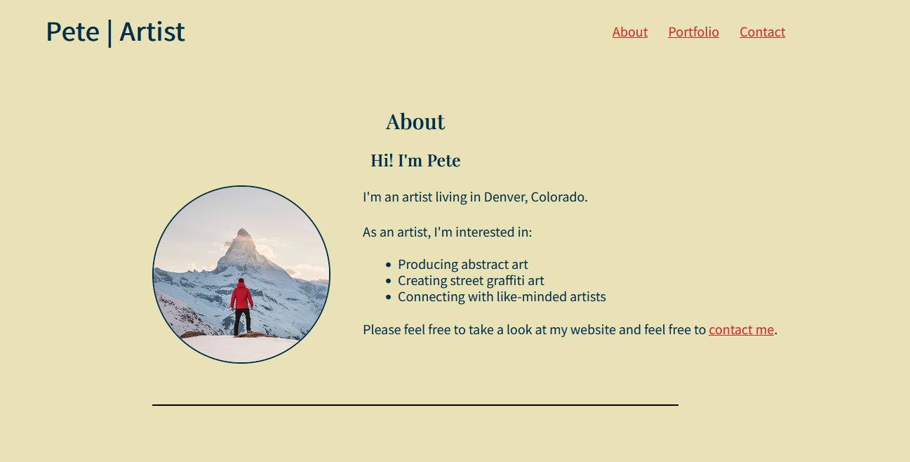

## Brief Project Description 
This project redesigns Pete's artist portfolio website from a narrow, vertical layout to a modern horizontal layout using CSS Flexbox.The site showcases Pete's abstract art, graffiti art, and collaboration services. The redesign improves user experience through better space utilization, professional typography hierarchy, and modern layout techniques while maintaining readability.

## Originial vs Revised layout 
 # Original Layout 
 
 The original layout is all center aligned which may be easier to navigate on a mobile device but awkward when seen on a wide screen 
 # Revised Layout
 
 The Revised layout is still centered bu ocuppies more of the space on the screen so it can be navigated on any layout and adopts to the screensize 

 ## Implementation Plan 
 I plan to implement this redesign by editing individual sections first and then making any page wide changes required

 1. Header
   - Align navigation bar with the Logo text and center horizontally within the header container
   - Revise Color theme and stule of the page with the objective of matching the mock up design provided
2. About
   - Align Pete's Image Horizontally with the "Hi! I'm Pete" text 
   - Change alignment so that "Hi! I'm Pete" is centered  and the Text is left aligned 
3. Portfolio 
    - Display projects horizontally instead of Vertically with 2 px spacing between them 
    - Change project description font to be 14 px
   
## Design Decisions

- about body text is left aligned and has a 40% maregin to achieve desired distance from the circle image

### Header 
   - Added Flex box property to Header
   - Changed Font of "Pete | Artist " to align more with the design provided 
   - Tweaked the padding so that the header elements maintained stylized spacing

## Lessons / Challenges
- Learned that in order to achieve the layout specified in the design the Header flex direction had to be row rather than column 

- About Section: 

      - I learned that I had to put both the image and the text body under one parent div so that they could show in the same row
      - Adjusted the margin on the text body to achieve desire distance

- Portfolio 

   - Added css class to parent div and then created portfolio-items style component 
   - I h
    

## Github commit history and screenshots illustritating this decision 
Commit 1: Initializing project with README Requirements 
Commit 2 : Header modifications

## AI Tools 
- Usage of Claude Haiku 4.5 agent to ask questions: 
   - How to align elements horizontally in header 

