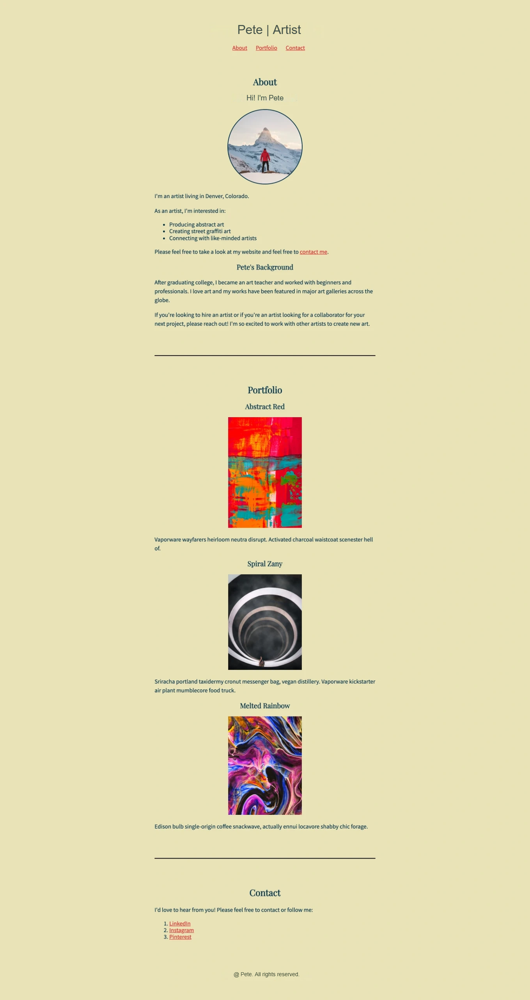
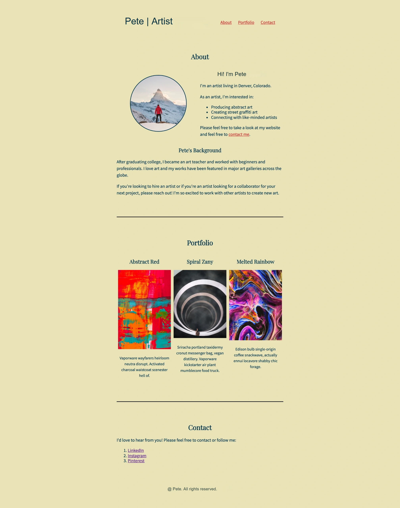

## Brief Project Description 
This project redesigns Pete's artist portfolio website from a narrow, vertical layout to a modern horizontal layout using CSS Flexbox.The site showcases Pete's abstract art, graffiti art, and collaboration services. The redesign improves user experience through better space utilization, professional typography hierarchy, and modern layout techniques while maintaining readability.

## Originial vs Revised layout 
 # Original Layout 
 
 The original layout is all center aligned which may be easier to navigate on a mobile device but awkward when seen on a wide screen 
 # Revised Layout
 
 The Revised layout is still centered bu ocuppies more of the space on the screen so it can be navigated on any layout and adopts to the screensize 

 ## Implementation Plan 
 I plan to implement this redesign by editing individual sections first and then making any page wide changes required

 1. Header
   - Align navigation bar with the Logo text and center horizontally within the header container
   - Revise Color theme and stule of the page with the objective of matching the mock up design provided
2. About
   - Align Pete's Image Horizontally with the "Hi! I'm Pete" text 
   - Change alignment so that "Hi! I'm Pete" is centered  and the Text is left aligned 
3. Portfolio 
    - Display projects horizontally instead of Vertically with 2 px spacing between them 
    - Change project description font to be 14 px
   
## Design Decisions

## Lessons / Challenges

## AI Tools 
- Disclosure of all AI Tools and justification for using them 

## Justification of Key decisions, challenges , debugging and learning moments

## Github commit history and screenshots illustritating this decision 
